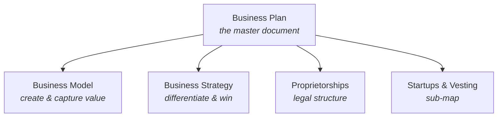

# Business — Map of Content

> [!INFO] About this map
> A **Map of Content (MOC)** is a curated hub that gathers and gives context to the notes in a domain. Use it — not the folder tree — as your entry point to *Business*: start here, follow the links, and let the structure guide your thinking.

The **Business** domain studies how an enterprise creates, delivers, and captures value, and how it organizes itself legally and strategically to do so sustainably.

---

## Orientation — How the notes relate
The **[[Business Plan]]** is the master document that ties everything together. It rests on three supporting pillars: *how value is made*, *how the firm wins*, and *how the firm is structured*.

## Notes in this domain

### Enterprise Organization

- **[[Business Plan]]** — The master document: the opportunity, the market, and how the organization will pursue it.
- **[[Business Model]]** — How the business creates and captures value across market and delivery.
- **[[Business Strategy]]** — How the firm differentiates, positions itself, and allocates resources to win.
- **[[Proprietorships]]** — Legal structures and their trade-offs in control, liability, and capital.

### Startups & Vesting

- [[* Startups & Vesting MOC]] — sub-map: startup fundamentals, governance, and key-people vesting.

## Finances
- Basics

---

## Strategic Inquiries

> [!QUOTE] Questions a strong business should be able to answer
> - Does the plan clearly articulate how the business will **differentiate** itself?
> - Does it identify the **resources** required to execute the strategy?
> - Is there a clear path to **value creation** for the target customer?
> - Which **legal structure** best fits the funding ambitions and liability profile?

---

## Tending this map

> [!TIP] Second-brain maintenance
> - Add a note here the moment it belongs to *Business* — a MOC is only useful while it stays current.
> - Link bidirectionally: every new note should point *back* to this MOC, and this MOC should point *to* it.
> - When a cluster outgrows a single section (e.g. *Strategy*), promote it into its own sub-MOC and link it from here.

---

## Related

- [[Business Plan]]
- [[Business Model]]
- [[Business Strategy]]
- [[Proprietorships]]
- [[* Startups & Vesting MOC]]