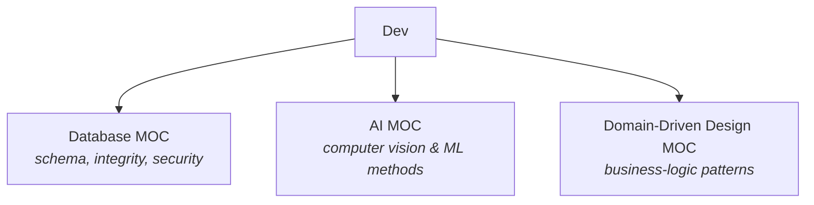

# Development — Map of Content

> [!INFO] About this map
> A **Map of Content (MOC)** is a curated hub that gathers and gives context to the notes in a domain. Use it — not the folder tree — as your entry point to *Development*: start here and let the links guide you into each sub-domain.

The **Development** domain collects engineering knowledge across backend systems and applied AI. It branches into focused sub-maps rather than holding atomic notes directly.

---

## Sub-domains

- **[[* Database MOC|Database MOC]]** — designing robust relational databases: modelling, normalization, keys, SQL, security.
- **[[* AI MOC|AI MOC]]** — applied AI methods, starting with computer-vision post-processing.
- **[[* Domain-Driven Design MOC|Domain-Driven Design]]** — implementing business logic: tactical patterns from transaction scripts to the domain model.

---

## Tending this map

> [!TIP] Second-brain maintenance
> - Each sub-MOC sets `up: "[[* Dev MOC]]"`; this map links back down to it.
> - Add a new sub-MOC here when a fresh area (e.g. *Frontend*, *DevOps*) accumulates enough notes to warrant its own hub.
> - Cross-cutting follow-ups live in [[Next Steps]]; new areas to learn live in [[New Studies]].

---

## Related

- Up: [[Home]]
- Down: [[* Database MOC]] · [[* AI MOC]] · [[* Domain-Driven Design MOC]]
