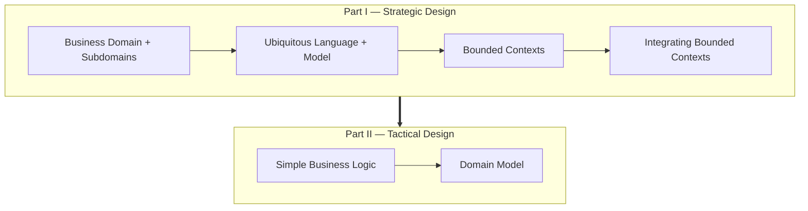
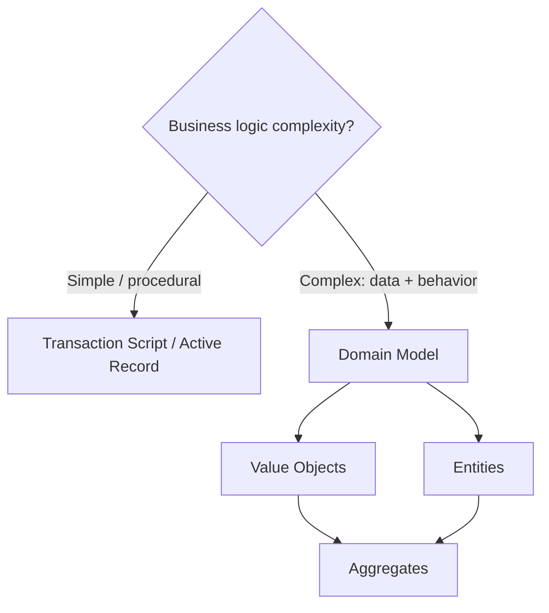

# Domain-Driven Design — Map of Content

> [!INFO] About this map
> A **Map of Content (MOC)** is a curated hub that gathers and gives context to the notes in a domain. Use it — not the folder tree — as your entry point to *Domain-Driven Design*: start here, follow the links, and let the structure guide your thinking.

The central hub for *Domain-Driven Design*, mirroring the two halves of the book: **Part I — Strategic Design** (how to analyze a business, share a language, and carve it into bounded contexts) and **Part II — Tactical Design** (how to implement that business logic in code, from procedural scripts to the full domain model).

---

## Part I — Strategic Design

### Analyzing Business Domains

- [[Business Domain and Subdomains]] — a domain decomposes into subdomains, each a fine-grained problem domain of one of three types.
- [[Core Subdomain]] — the competitive advantage: most complex, most dynamic, build in-house with your best people.
- [[Generic Subdomain]] — a solved, common problem: complex but no differentiation, so buy or reuse.
- [[Supporting Subdomain]] — differentiating but low-complexity: build in-house, but not with your top talent.
- [[Subdomain Boundary Heuristics]] — how far to distill subdomains: stop when it reveals no new design insight.

### Discovering Domain Knowledge

- [[Agree on the Problem Before the Solution]] — alignment first: agree on problem → solution → implementation.
- [[Domain Expert Mental Model]] — software should mimic how the expert thinks; the analyst translates that model into code.
- [[Ubiquitous Language]] — one shared, consistent, business vocabulary that kills lossy expert-to-code translation.
- [[Model as Abstraction]] — a model is the minimal representation of domain knowledge: always correct, always incomplete.

### Managing Complexity — Bounded Contexts

- [[Bounded Context]] — stratify the ubiquitous language so each term's meaning is bound to its context.
- [[Models Are Designed, Subdomains Are Discovered]] — the core distinction between what you find and what you choose.

### Integrating Bounded Contexts

- [[Bounded Context Integration (Contracts)]] — separate contexts are services that talk through explicit contracts.
- [[Shared Kernel]] — co-owned shared model; use only when duplication costs more than coordination.
- [[Customer-Supplier (Upstream & Downstream)]] — client/server collaboration, including the conformist stance.
- [[Anti-Corruption Layer]] — a downstream translation layer (and its upstream mirror, the open host service).
- [[Context Map]] — the visual overview of all bounded contexts and their relationships.

---

## Part II — Tactical Design

### Simple Business Logic

- [[Business Logic as Transactions]] — the foundational frame: every pattern choreographs receive → read → validate → modify → respond.
- [[Transaction Script]] — procedures organizing straightforward logic, one script per transaction.
- [[Active Record]] — row-wrapping objects that carry their own persistence and validation.

### Complex Business Logic — Domain Model

- [[Domain Model]] — the pattern for when data and behavior must evolve together as complex business logic.
- [[Value Object]] — immutable, identified by its values, validated at construction.
- [[Entity]] — mutable, identified by a stable ID, meaningful only inside an aggregate.
- [[Aggregate]] — the consistency and transaction boundary around entities and value objects.
- [[Aggregate Root]] — the single entry point through which all commands to an aggregate flow.
- [[Aggregate Command]] — the load → validate → enforce → execute → return write pipeline.
- [[Domain Event]] — a past-tense message announcing something that already happened in the domain.
- [[Domain Service]] — stateless orphan logic that doesn't belong to any single aggregate.

### Cross-cutting

- [[Optimistic Concurrency Control]] — the versioning mechanism that prevents lost updates, underpinning both Transaction Script idempotency and aggregate consistency.

---

## Choosing a tactical pattern

---

## Tending this map

> [!TIP] Second-brain maintenance
> - Add a note here the moment it belongs to *Domain-Driven Design* — a MOC is only useful while it stays current.
> - Link bidirectionally: every note sets `up: "[[* Domain-Driven Design MOC]]"`, and this MOC links back to it.
> - Active follow-ups live in [[Next Steps]]; unexplored topics (repositories, factories, event sourcing, CQRS) live in [[New Studies]].

---

## Related

- Up: [[* Dev MOC]]
- Down: [[Business Domain and Subdomains]] · [[Core Subdomain]] · [[Generic Subdomain]] · [[Supporting Subdomain]] · [[Subdomain Boundary Heuristics]] · [[Agree on the Problem Before the Solution]] · [[Domain Expert Mental Model]] · [[Ubiquitous Language]] · [[Model as Abstraction]] · [[Bounded Context]] · [[Models Are Designed, Subdomains Are Discovered]] · [[Bounded Context Integration (Contracts)]] · [[Shared Kernel]] · [[Customer-Supplier (Upstream & Downstream)]] · [[Anti-Corruption Layer]] · [[Context Map]] · [[Business Logic as Transactions]] · [[Transaction Script]] · [[Active Record]] · [[Domain Model]] · [[Value Object]] · [[Entity]] · [[Aggregate]] · [[Aggregate Root]] · [[Aggregate Command]] · [[Domain Event]] · [[Domain Service]] · [[Optimistic Concurrency Control]]
