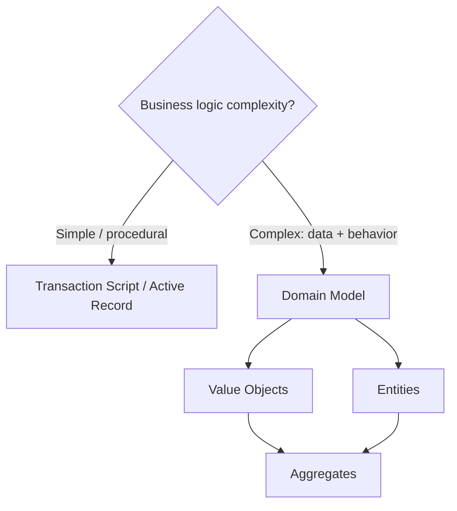

# Domain-Driven Design — Map of Content

> [!INFO] About this map
> A **Map of Content (MOC)** is a curated hub that gathers and gives context to the notes in a domain. Use it — not the folder tree — as your entry point to *Domain-Driven Design*: start here, follow the links, and let the structure guide your thinking.

The central hub for implementing business logic — the tactical patterns, from the simplest procedural scripts to the full domain model.

---

## Simple Business Logic

- [[Business Logic as Transactions]] — the foundational frame: every pattern choreographs receive → read → validate → modify → respond.
- [[Transaction Script]] — procedures organizing straightforward logic, one script per transaction.
- [[Active Record]] — row-wrapping objects that carry their own persistence and validation.

## Complex Business Logic — Domain Model

- [[Domain Model]] — the pattern for when data and behavior must evolve together as complex business logic.
- [[Value Object]] — immutable, identified by its values, validated at construction.
- [[Entity]] — mutable, identified by a stable ID, meaningful only inside an aggregate.
- [[Aggregate]] — the consistency and transaction boundary around entities and value objects.
- [[Aggregate Root]] — the single entry point through which all commands to an aggregate flow.
- [[Aggregate Command]] — the load → validate → enforce → execute → return write pipeline.
- [[Domain Event]] — a past-tense message announcing something that already happened in the domain.
- [[Domain Service]] — stateless orphan logic that doesn't belong to any single aggregate.

## Cross-cutting

- [[Optimistic Concurrency Control]] — the versioning mechanism that prevents lost updates, underpinning both Transaction Script idempotency and aggregate consistency.

---

## Choosing a pattern

---

## Tending this map

> [!TIP] Second-brain maintenance
> - Add a note here the moment it belongs to *Domain-Driven Design* — a MOC is only useful while it stays current.
> - Link bidirectionally: every note sets `up: "[[* Domain-Driven Design MOC]]"`, and this MOC links back to it.
> - Active follow-ups live in [[Next Steps]]; unexplored topics (strategic design, repositories, event sourcing, CQRS) live in [[New Studies]].

---

## Related

- Up: [[* Dev MOC]]
- Down: [[Business Logic as Transactions]] · [[Transaction Script]] · [[Active Record]] · [[Domain Model]] · [[Value Object]] · [[Entity]] · [[Aggregate]] · [[Aggregate Root]] · [[Aggregate Command]] · [[Domain Event]] · [[Domain Service]] · [[Optimistic Concurrency Control]]
