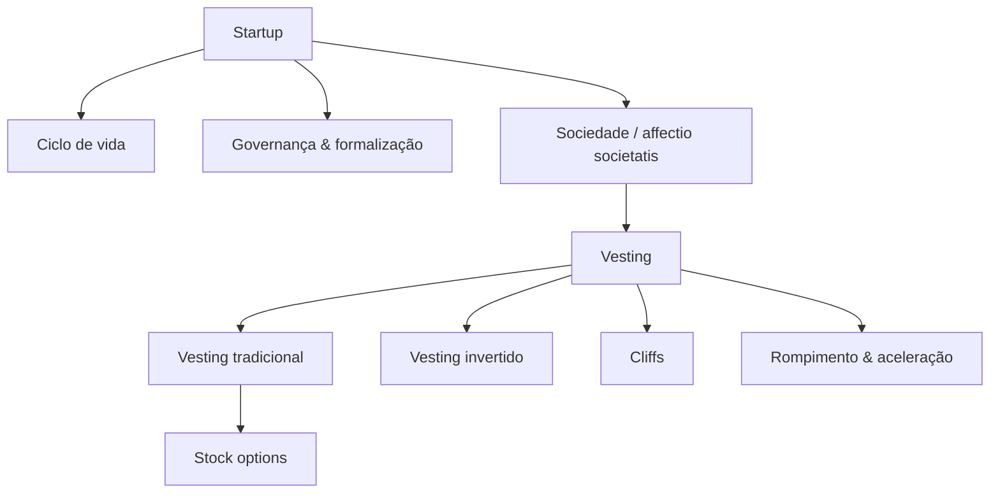

# Startups & Vesting — Mapa de Conteúdo

> [!INFO] Sobre este mapa
> Hub do domínio *Startups & Vesting*: os fundamentos jurídicos da startup, sua governança e formalização, a sociedade entre os fundadores (affectio societatis) e a mecânica de vesting aplicada a sócios e colaboradores-chave.

## Orientação — Como as notas se relacionam

## Startup Fundamentals

- [[Startup as a Legal Concept]] — o que juridicamente caracteriza uma startup.
- [[Startup Lifecycle]] — os estágios pelos quais uma startup passa até a maturidade.
- [[Startup Formalization]] — como e quando formalizar a startup perante o direito.
- [[Triple Helix Model of Innovation]] — a interação entre universidade, empresa e governo na inovação.
- [[Do It Yourself Before Hiring]] — por que os fundadores devem executar as funções antes de contratar.

## Governance & Legal Communication

- [[Corporate Governance Principles]] — princípios que orientam a governança corporativa da startup.
- [[Legal Design]] — comunicação jurídica clara e acessível como ferramenta de governança.

## Sociedade & Key People

- [[Affectio Societatis]] — o elemento subjetivo que une os sócios em torno de um propósito comum.
- [[Key People Selection for Vesting]] — critérios para escolher quem deve receber vesting.

## Vesting Mechanics

- [[Vesting]] — nota-hub: o mecanismo de aquisição gradual de participação societária.
- [[Traditional Vesting]] — vesting tradicional: aquisição progressiva de participação ao longo do tempo.
- [[Inverted Vesting]] — vesting invertido: participação já concedida, sujeita a recompra em caso de saída antecipada.
- [[Cliffs in Vesting Schedules]] — o período mínimo de permanência antes da primeira aquisição.
- [[Stock Options as Vesting Instrument]] — opções de compra de ações como instrumento de vesting.
- [[Vesting Termination and Acceleration]] — o que ocorre no rompimento do vínculo e a aceleração de cláusulas de vesting.

## Related

- Up: [[* Business MOC]]
- Down: [[Startup as a Legal Concept]] · [[Startup Lifecycle]] · [[Startup Formalization]] · [[Corporate Governance Principles]] · [[Legal Design]] · [[Triple Helix Model of Innovation]] · [[Do It Yourself Before Hiring]] · [[Affectio Societatis]] · [[Vesting]] · [[Key People Selection for Vesting]] · [[Traditional Vesting]] · [[Inverted Vesting]] · [[Cliffs in Vesting Schedules]] · [[Stock Options as Vesting Instrument]] · [[Vesting Termination and Acceleration]]
