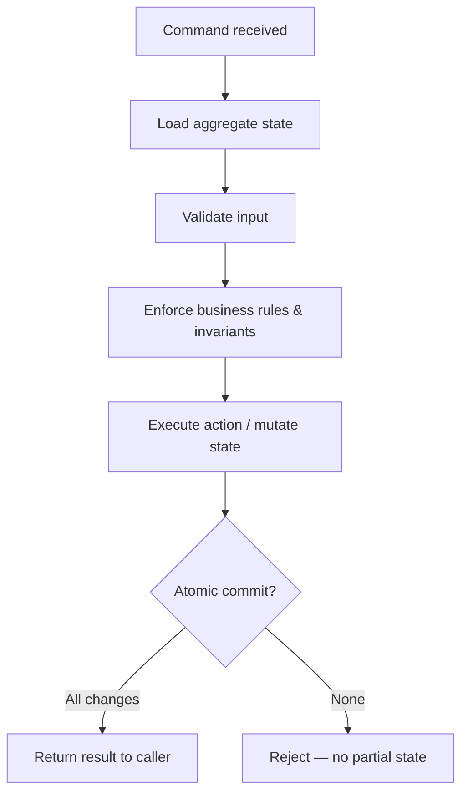

# Aggregate Command

A command is the application-layer logic that performs a write or data modification within an [[Aggregate]] — as opposed to a read. Handling a command follows a fixed pipeline, not an ad hoc one:

1. **Load** the aggregate's current state.
2. **Validate** the input.
3. **Enforce** business rules and invariants.
4. **Execute** the required action (mutate state).
5. **Return** the result to the caller.

The whole pipeline commits atomically — all changes land, or none do; there's no partial state left behind.

Implementation note: exactly how commands are expressed in code is a matter of preference, but a good meta-model is to define command structures explicitly and pass them polymorphically to the app-layer component responsible for the aggregate.

## Related

- [[Aggregate]] — the consistency boundary a command operates within.
- [[Aggregate Root]] — commands are routed through the root, never straight into internal entities.
- [[Optimistic Concurrency Control]] — the versioning check that guards the "load → execute → return" pipeline from concurrent writes.
