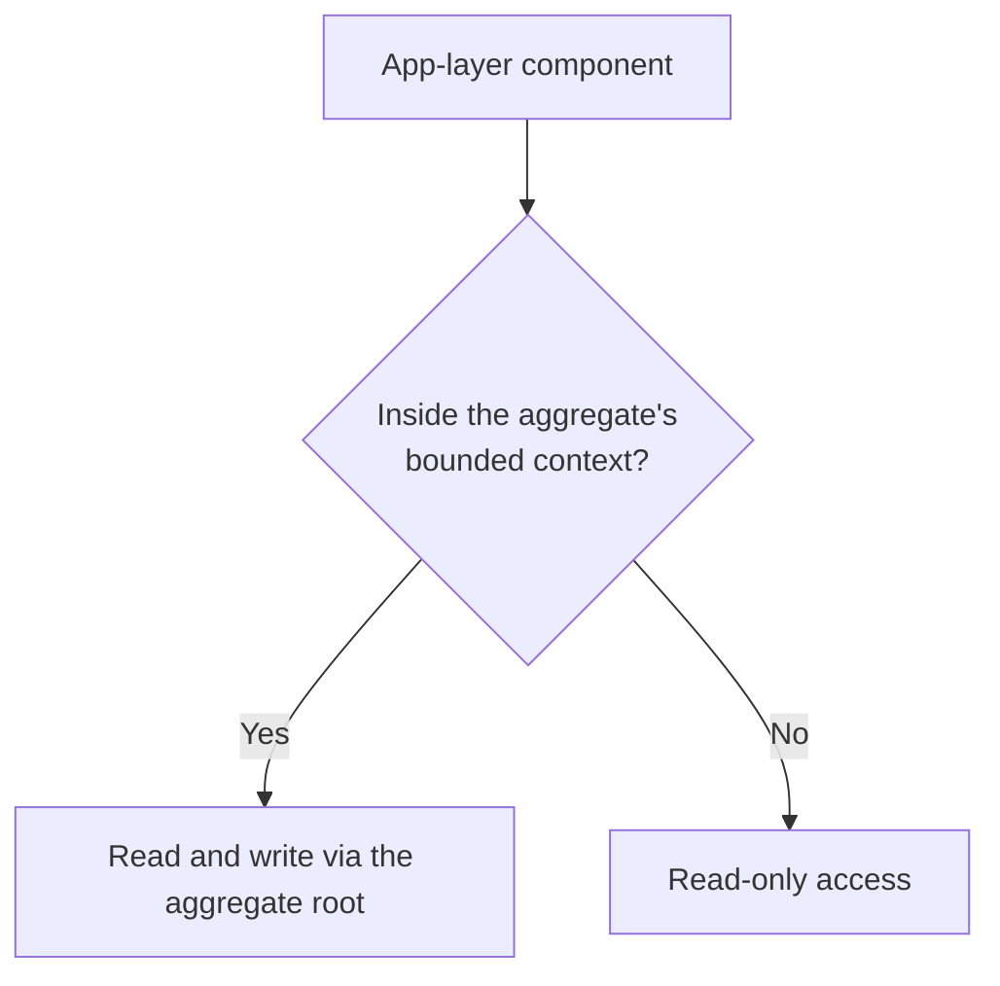

# Aggregate

An aggregate is a cluster of entities and value objects that must keep its state consistent at all times — it's a consistency and transaction boundary. Aggregates are what make entities necessary in the first place.

An aggregate is something expected to change over time. To handle that dynamism, it has to stay consistent at all times, which means it validates whatever the application layer or client tries to do to it — it doesn't just passively accept mutations.

**Bounded context.** An aggregate belongs to a business domain — its bounded context. App-layer components outside that business logic may only *read* the aggregate. Components inside it may both read and write, following the pipeline: load → validate input → enforce rules/invariants → execute → return (see [[Aggregate Command]]).

**Consistency mechanisms.** To prevent concurrency issues, the aggregate ensures the version being overwritten matches the version originally read, so a later transaction can't blindly overwrite the first transaction's commit (see [[Optimistic Concurrency Control]]). It also relies on atomic operations — all changes commit, or none do.

**Keep it as small as possible.** An aggregate should contain only the entities actually needed for that piece of business logic. Making it too large hurts performance and scalability. Related entities inside the aggregate are *strongly* consistent — a change to one cascades immediately to its dependents. Modifying multiple entities in a single transaction requires organizing them in a hierarchy under a root entity.

**Decision rule.** An entity belongs inside the aggregate if working on eventually-consistent (stale) data for that entity could lead to an invalid system state. If staleness is tolerable, the entity probably doesn't need to live inside the aggregate boundary.

## Related

- [[Entity]] — aggregates are the reason entities are needed at all: identity plus consistency rules.
- [[Aggregate Root]] — the single entry point through which the aggregate is read and written.
- [[Aggregate Command]] — the write pipeline an aggregate enforces on incoming operations.
- [[Domain Event]] — how an aggregate announces state changes to the rest of the system.
- [[Optimistic Concurrency Control]] — the versioning mechanism that protects aggregate consistency under concurrent writes.
- [[Bounded Context]] — an aggregate must belong to a single bounded context; that boundary defines who may write it.
