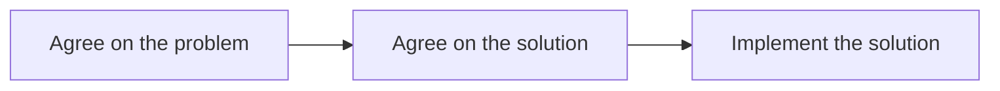

# Agree on the Problem Before the Solution

Before any software gets built, everyone has to be **on the same page** — level with the same vision and understanding the same things. Alignment is a prerequisite, not a by-product.

The sequence is explicit:

> We must first agree on the problem, then we agree on the solution, and finally we implement the solution.

Concretely, for a project to succeed, all stakeholders must agree on three things: the **problem** being solved, the **solution** being built for it, and both the **functional and non-functional requirements** of that solution. Skipping the agreement on the problem and jumping to a solution is how projects diverge — everyone builds toward a different unstated goal.

This alignment is what a clear, continuous communication channel is *for*, and it is the human precondition that makes the [[Ubiquitous Language]] and faithful translation of the [[Domain Expert Mental Model]] possible.

## Related

- [[Ubiquitous Language]] — the shared vocabulary that keeps the agreement intact.
- [[Domain Expert Mental Model]] — what the team is aligning around.
