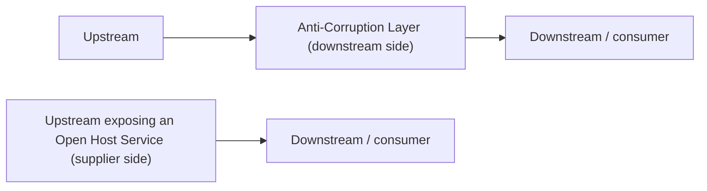

# Anti-Corruption Layer

An **anti-corruption layer (ACL)** is a **translation layer** used within a [[Customer-Supplier (Upstream & Downstream)|customer-supplier]] relationship. It sits on the **downstream (consumer) side** and translates what the upstream supplier sends into a form adapted to the consumer's own model — so the supplier's contracts feed the downstream cleanly without corrupting its model.

**When to use it** — instead of the downstream conforming to the upstream, protect it with an ACL when:

- the **server cannot** provide what the client needs in an organized manner;
- the **downstream bounded context contains a [[Core Subdomain]]** — something important worth shielding; or
- the supplier's **contracts and models change often**.

**Open Host Service — the mirror image.** The translation layer does not have to sit downstream. When the translation instead sits on the **supplier's (upstream) side**, it is called an **open host service**: the supplier publishes and maintains a stable, translated interface for its consumers. ACL protects the consumer from the supplier; an open host service is the supplier volunteering a clean interface to its consumers.

## Related

- [[Customer-Supplier (Upstream & Downstream)]] — the relationship this protects, and its conformist alternative.
- [[Bounded Context Integration (Contracts)]] — the broader framing this pattern sits under.
- [[Core Subdomain]] — a downstream core subdomain is a key reason to add an ACL.
