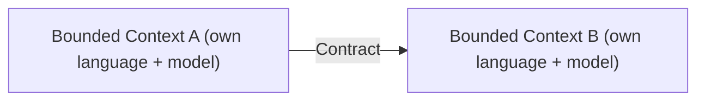

# Bounded Context Integration (Contracts)

Each model has its own [[Bounded Context]], each bounded context maps to one or more subdomains, and those subdomains fall into one of the three [[Business Domain and Subdomains|subdomain types]]. In practice a **bounded context is usually a service**, and services have to talk to each other.

The problem: each context uses a **different language** and a **different model**. You cannot just wire them together directly. Instead, contexts communicate through **contracts** — explicit agreements about what crosses the boundary.

Contracts also resolve a subtle issue: the **same entity** can appear in more than one model, but its *usage* differs from model to model. The entity is not shared wholesale; the contract defines exactly how one context's version relates to another's. This is what lets separate contexts collaborate without collapsing their distinct models into one.

The concrete ways to structure this collaboration — sharing a model, a client/server relationship, or a translation layer — are the integration patterns below.

## Related

- [[Bounded Context]] — the units being integrated.
- [[Shared Kernel]] — integration by co-owning a small shared model.
- [[Customer-Supplier (Upstream & Downstream)]] — integration as a client/server relationship.
- [[Anti-Corruption Layer]] — integration via a translation layer.
- [[Context Map]] — the visual overview of all these integrations.
