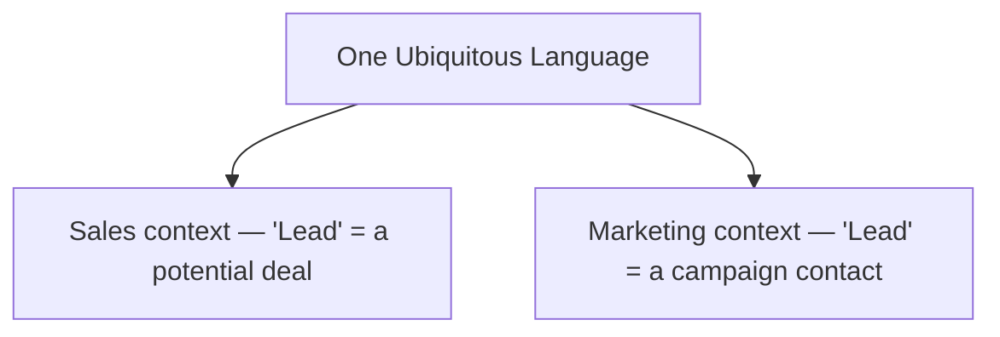

# Bounded Context

In a realistic organization, different domain experts tackle and understand the same problem in different ways — the same *word* can mean different things to a marketing expert and a sales expert. To stop that from producing duplicated or conflicting understanding, you use a **bounded context**.

A bounded context **stratifies the [[Ubiquitous Language]] into multiple language groups**, and assigns each group the explicit context in which it applies. A term's meaning is then always bound to its context, which removes ambiguity and keeps communication between all parties clear.

**Models live inside contexts.** Each bounded context carries its own model. One ubiquitous language can therefore hold *multiple* models that share similar-looking entities, yet within their own bounded context each entity's meaning is unambiguous.

**Sizing.** You decide how big, small, or fragmented a bounded context is using the same rule of thumb as [[Subdomain Boundary Heuristics|subdomain boundaries]]: find a set of coherent use cases that operate on the same data, and avoid decomposing them across multiple contexts. Bounded contexts can also be derived from **semantics** — a group of words that carry a shared meaning when used in that context.

**The monolith limit.** If a single model's bounded context stretches to cover the *entire* business domain, you have a monolith.

## Related

- [[Ubiquitous Language]] — the thing a bounded context stratifies.
- [[Subdomain Boundary Heuristics]] — the sizing rule of thumb reused here.
- [[Models Are Designed, Subdomains Are Discovered]] — a context's model is designed, not discovered.
- [[Bounded Context Integration (Contracts)]] — how separate contexts then talk to each other.
- [[Aggregate]] — a tactical building block that must live within one bounded context.
