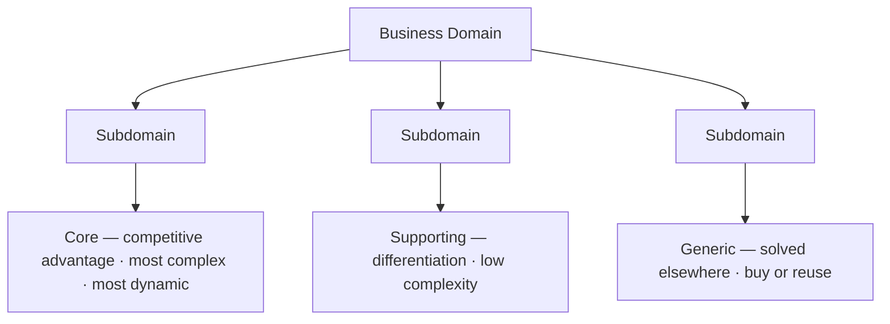

# Business Domain and Subdomains

A **business domain** is the company's main area of activity. It is not implemented as one monolithic thing — it decomposes into **subdomains**, each a fine-grained instance of one aspect of the overall domain.

A subdomain is really a *finer-grained problem domain*: subdomains are derived from problems, and each one's goal is to provide solutions for a specific business capability. So the way to read a business is problem-first — the company faces problems, those problems carve the domain into subdomains, and each subdomain is the coherent slice of logic and activity that solves its problem.

Every subdomain falls into one of **three types**, which differ along three axes — how *complex* they are, whether they provide competitive *differentiation*, and how *dynamic* (frequently changing) they are:

- [[Core Subdomain]] — the competitive advantage; most complex and most dynamic.
- [[Supporting Subdomain]] — provides differentiation but is low in complexity.
- [[Generic Subdomain]] — a solved, common problem; complex but no differentiation.

Classifying each subdomain by type is what drives the big decisions: where to put your best people, and what to build versus buy.

## Related

- [[Core Subdomain]] — the highest-value subdomain type; where to invest.
- [[Generic Subdomain]] — the buy/reuse type.
- [[Supporting Subdomain]] — the low-complexity, in-house-but-not-precious type.
- [[Subdomain Boundary Heuristics]] — how far to distill a domain into subdomains.
- [[Bounded Context]] — the language boundary layered on top of these problem boundaries.
