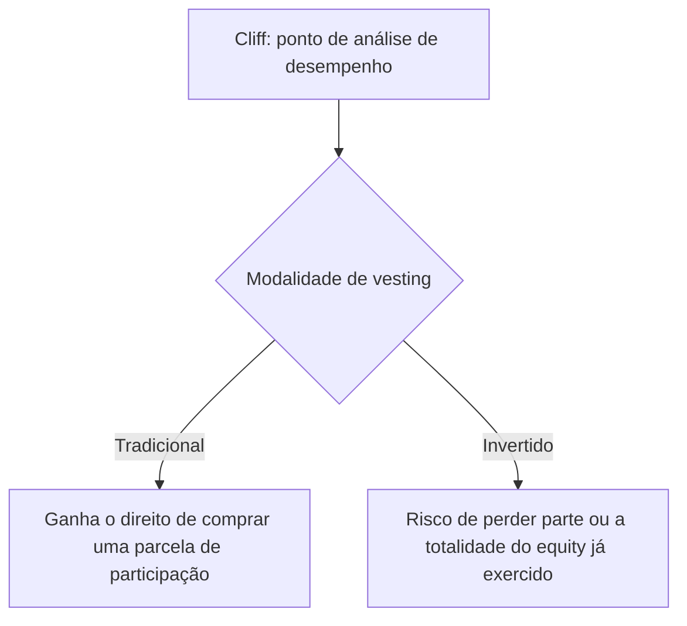

# Cliffs in Vesting Schedules

Cliffs são pontos de análise de desempenho que pautam o cronograma de vesting. O efeito de um cliff, porém, é oposto conforme a modalidade adotada.

No vesting tradicional, cada cliff é um ponto em que o beneficiário ganha o direito de comprar uma determinada parcela de participação — um efeito aquisitivo.

No vesting invertido, o beneficiário já exerce todo o seu direito sobre o equity desde o início; a cada cliff, ele corre o risco de perder o que já exerce, ou parte disso, caso as metas não sejam atingidas — um efeito resolutivo, proporcional às métricas de desempenho não cumpridas.

## Related

- [[Traditional Vesting]] — detalha o efeito aquisitivo do cliff nessa modalidade.
- [[Inverted Vesting]] — detalha o efeito resolutivo do cliff nessa modalidade.
- [[Vesting Termination and Acceleration]] — um cliff com resultado negativo pode levar ao rompimento do contrato.
