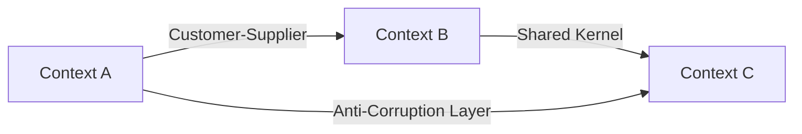

# Context Map

A **context map** is a **visual representation of the bounded contexts and their relationships** — how they coordinate and integrate with one another. It turns the abstract web of [[Bounded Context Integration (Contracts)|integrations]] (shared kernels, customer-supplier links, anti-corruption layers) into a single high-level picture.

It gives you two things at once:

- a **high-level design** view of the system's bounded contexts, and
- a holistic view of the **organizational / communication pairings** between the teams that own them.

Because it exposes both the technical and the team-communication structure, a context map is ideal to introduce **right from the get-go** of a project, rather than reconstructing it after the fact.

## Related

- [[Bounded Context]] — the units a context map lays out.
- [[Bounded Context Integration (Contracts)]] — the relationships a context map visualizes.
- [[Shared Kernel]] · [[Customer-Supplier (Upstream & Downstream)]] · [[Anti-Corruption Layer]] — the integration styles drawn on the map.
