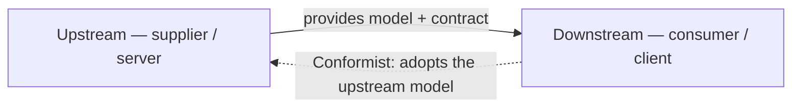

# Customer-Supplier (Upstream & Downstream)

**Customer-supplier** is a way to establish collaboration between bounded contexts as a **client/server** relationship:

- **Downstream** = the **consumer / client**.
- **Upstream** = the **supplier / server**.

It keeps a clean separation of concerns between the teams working on each bounded context, since the direction of dependency is explicit.

**The Conformist approach.** Within a customer-supplier relationship, the downstream can take a **conformist** stance: it **adapts itself to meet the upstream (server) model** rather than negotiating its own. Conforming makes sense when the downstream can *afford* to accept the supplier's model as-is.

Conforming stops being acceptable — and you reach instead for an [[Anti-Corruption Layer]] — when the situation resists it: the server can't provide what the client needs in an organized way, the **downstream contains a [[Core Subdomain]]** worth protecting, or the upstream's contracts and models **change often**.

## Related

- [[Bounded Context Integration (Contracts)]] — the broader framing this pattern sits under.
- [[Anti-Corruption Layer]] — what to use when the downstream should not conform.
- [[Shared Kernel]] — the alternative where both contexts co-own a shared model.
- [[Core Subdomain]] — a downstream core subdomain is a reason not to conform.
