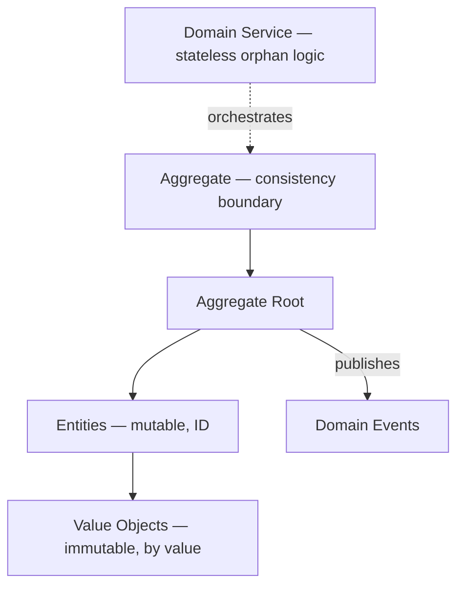

# Domain Model

When a situation is complex — when you must manipulate both the data and its behavior together — use a Domain Model instead of a simple [[Transaction Script]]. The trigger to reach for it is that the data and its behavior evolve together as part of complex business logic; a plain procedural script can't hold that complexity safely.

A Domain Model is built from four kinds of building block:

- **Value objects** — immutable, compared by value, not identity.
- **Entities** — mutable, identified by an ID that persists across changes.
- **Aggregates** — the consistency boundary; made up of entities and value objects.
- **Domain events** — published by the aggregate to signal that something meaningful happened.

Alongside these, **domain services** hold logic that doesn't belong to any single aggregate — orphan logic that orchestrates across the model instead of living inside one object.

How they compose: the aggregate is made of entities and value objects, the aggregate root is the single entry point that receives commands and publishes domain events, and domain services orchestrate across multiple aggregates when needed. Throughout all of this, the ubiquitous language is maintained consistently across the whole model — the same terms used by domain experts show up in the code.

## Related

- [[Value Object]] — immutable building block, compared by value.
- [[Entity]] — mutable building block, identified by ID.
- [[Aggregate]] — the consistency boundary composed of entities and value objects.
- [[Domain Event]] — published by the aggregate root.
- [[Domain Service]] — holds orphan logic that doesn't fit inside one aggregate.
- [[Transaction Script]] — the simple counterpart; contrast of simple vs. complex business logic.
- [[Ubiquitous Language]] — the shared vocabulary a domain model keeps alive inside the code.
