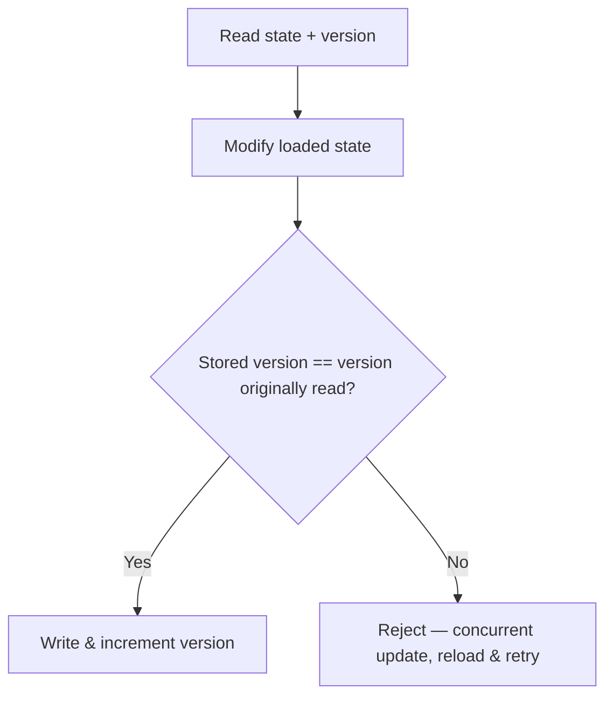

# Optimistic Concurrency Control

Optimistic Concurrency Control (OCC) prevents lost updates by verifying, at write time, that the state's version hasn't changed since it was read.

The flow: the caller reads the current value along with its version, and keeps/passes that version alongside any modification it makes to the loaded state. On write, the stored version must match the version originally read. If a concurrent transaction has already committed a change in the meantime, the later write is rejected — it has to reload and retry — rather than blindly overwriting the first transaction's commit.

This is a cross-cutting mechanism: it's the reasoning behind Transaction Script idempotency, and it's also the mechanism behind [[Aggregate]] consistency — it's how an aggregate stops a stale write from silently clobbering a newer one.

## Related

- [[Transaction Script]] — OCC is the mechanism behind its idempotency guarantee.
- [[Aggregate]] — OCC is the versioning mechanism that protects aggregate consistency under concurrent writes.
- [[Aggregate Command]] — the write pipeline that relies on OCC's version check before committing.
