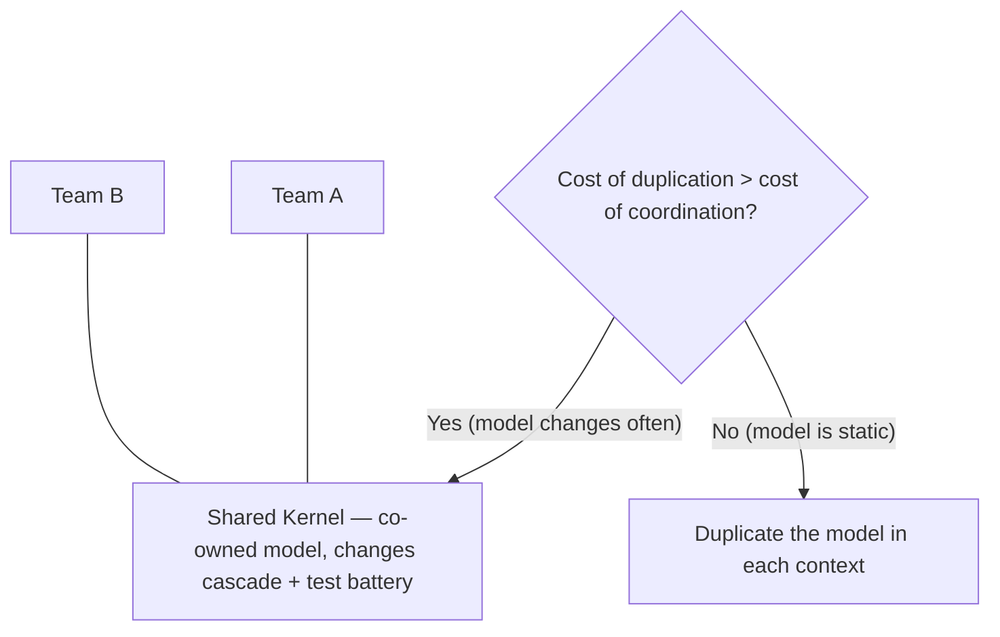

# Shared Kernel

A **shared kernel** is a small, shared bounded context: instead of strictly dividing two contexts so that a change in one model must be reworked into the other by another team, the teams **co-own a shared model**. Within that shared area you expose **only the parts of each model needed** for the two contexts to communicate.

**How it behaves.** A change in the shared model **cascades** into both consuming contexts, and every time a change is made you run a **battery of tests** to confirm the effects landed and nothing broke.

**When to use it — the core rule:** apply a shared kernel **only when the cost of duplication is higher than the cost of coordination**. In other words, only when integrating a change into both bounded contexts separately would take more effort than coordinating the change in one shared codebase. You can derive this from the **frequency of change**:

- Model **changes frequently** → duplication is costly → prefer the shared kernel.
- Model is **static** → duplicating it into each context is better.

**Why it's special.** A shared kernel is an **exception** to the rule that bounded contexts stay isolated from one another, because it is **coordinated by multiple teams** rather than owned by a single one. A practical picture is a monorepo-style shared folder that several bounded contexts consume from — which also makes it a pragmatic, intermediate way to **gradually modernize a legacy system** into separate bounded contexts.

## Related

- [[Bounded Context Integration (Contracts)]] — the broader framing this pattern sits under.
- [[Customer-Supplier (Upstream & Downstream)]] — the alternative when one context can serve the other.
- [[Bounded Context]] — the isolation rule that a shared kernel deliberately breaks.
