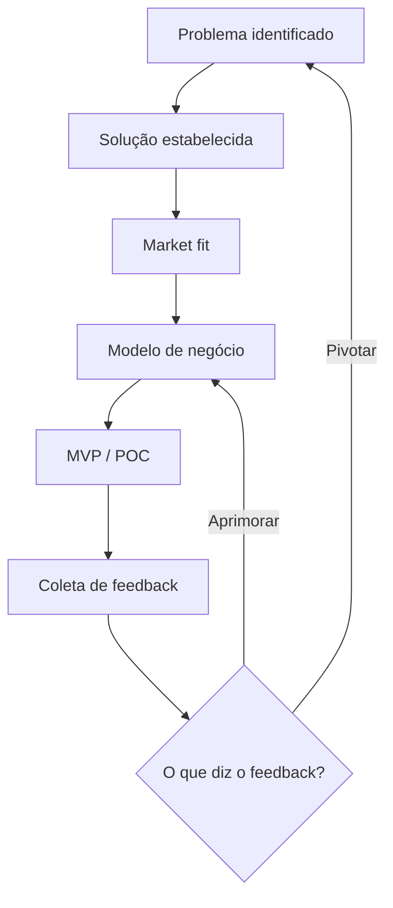

# Startup Lifecycle

O ciclo de vida de uma startup começa a partir de um problema identificado, para o qual se estabelece uma solução. Em seguida, busca-se o market fit dessa solução, a partir do qual se estabelece o modelo de negócio. Esse modelo é então materializado em um MVP (Minimum Viable Product), também chamado de POC (Prova de Conceito), cuja implementação permite a coleta de feedback dos clientes — feedback esse que busca identificar o que eles de fato querem.

A partir da coleta de feedback, há duas situações possíveis: o aprimoramento do modelo de negócio atual, ou o pivô da startup, reiniciando o ciclo a partir de um novo problema identificado.

Percorrer esse ciclo tem como finalidade final arrecadar investimentos, estabelecer vínculos e parcerias, e assim promover a escalabilidade do negócio e também a sua organização.

## Related

- [[Business Model]] — o modelo de negócio é uma das etapas percorridas dentro do ciclo.
- [[Business Strategy]] — o pivô mencionado no ciclo é tratado com mais profundidade na seção The Pivot.
- [[Startup as a Legal Concept]] — o ciclo de vida é a operacionalização prática do conceito legal de startup.
