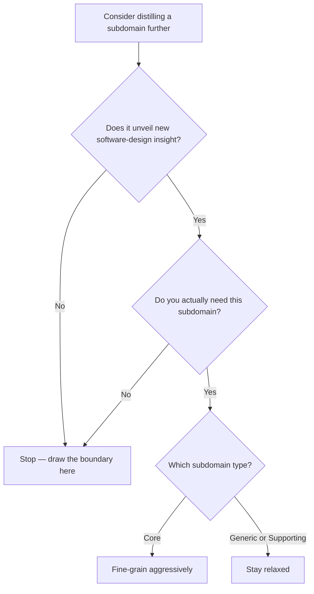

# Subdomain Boundary Heuristics

When identifying the boundaries of a subdomain, the question is: **how worthwhile is it to distill this subdomain into further subdomains?** Decomposition is not free, so you need a rule for when to stop.

**Stop when it reveals nothing new.** Keep distilling only while it unveils new insights that help you make software-design decisions. The moment further breakdown stops producing such insight, that's a good place to draw the boundary.

**Distill the core harder than the rest.** It is worth fine-graining subdomains tied to the [[Core Subdomain]] type, and being more relaxed about subdomains that fall under the [[Supporting Subdomain|supporting]] and [[Generic Subdomain|generic]] types.

**Ask whether you even need it.** Another gate on creating a new subdomain is simply whether that subdomain is actually needed at all.

This same rule of thumb — coherent, insight-bearing boundaries rather than arbitrary splitting — carries over to sizing a [[Bounded Context]].

## Related

- [[Business Domain and Subdomains]] — what these boundaries are carved out of.
- [[Bounded Context]] — reuses the same sizing rule of thumb for language boundaries.
