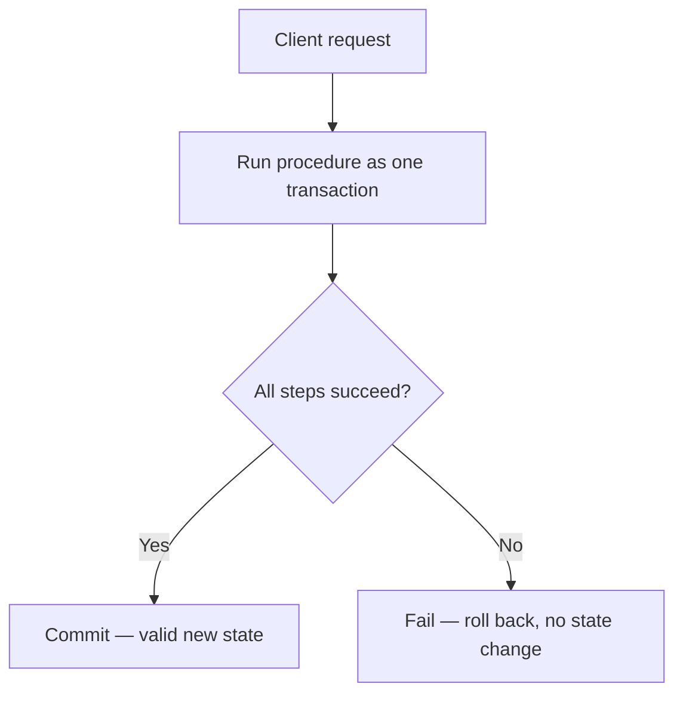

# Transaction Script

A Transaction Script organizes business logic as procedures, where each procedure handles a single client request. It's the simplest way to implement business logic — no elaborate object model, just a script that runs top to bottom.

It sits between the consumer and provider layers, and mostly does data manipulation rather than modeling rich behavior.

## The three rules

**Atomicity of state** — each operation either fully succeeds or fully fails. It can never leave the system in an invalid or partial state; there's no in-between.

**Idempotency** — repeating the same action returns the same response, even if it's executed multiple times. The concrete mechanism for this is pairing the script with [[Optimistic Concurrency Control]]: the caller reads the current value first and passes it as a parameter into the operation, so a stale or repeated call can be detected and handled safely instead of silently corrupting state.

**When to use it / when to avoid it** — use Transaction Script for straightforward, simple, procedural operations. Never use it for core subdomains — the pattern can't cope with the high complexity that core-subdomain business logic requires. Once the logic outgrows this simplicity, it's time to graduate to a [[Domain Model]].

## Related

- [[Active Record]] — a related pattern for organizing simple, data-centric logic.
- [[Business Logic as Transactions]] — the broader framing this pattern belongs to.
- [[Optimistic Concurrency Control]] — the mechanism that makes a Transaction Script's operations idempotent.
- [[Domain Model]] — what to graduate to when the business logic gets too complex for a procedural script.
- [[Core Subdomain]] — the case this pattern must never be used for; core-subdomain complexity outstrips a procedural script.
