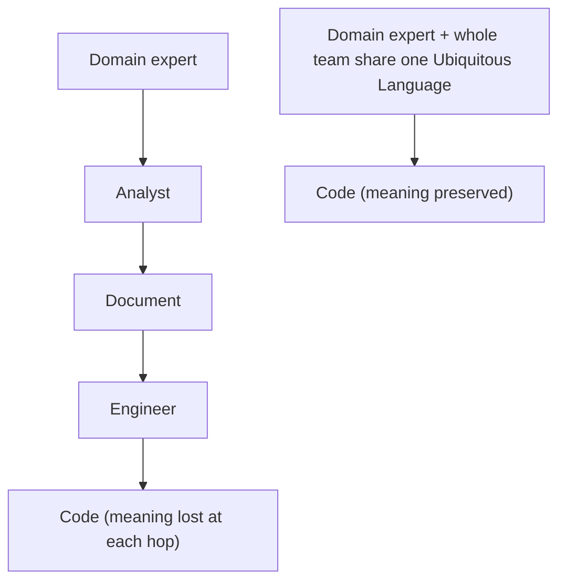

# Ubiquitous Language

The **ubiquitous language** is a shared vocabulary, grounded in the business domain, that is comprehensible to *everyone* involved — domain experts, analysts, and engineers alike. The point is that it is **not technical**: it is understandable within the knowledge domain, so the whole team speaks the same way about the same things.

**Why it exists — to kill lossy translation.** The traditional flow passes knowledge down a chain: the domain expert explains it, an analyst translates it into a document more approachable for engineers, and engineers translate that into code. Every hop loses information. A ubiquitous language removes those translation steps by giving everyone one vocabulary from the start.

**It must be consistent.** Use the same terms to mean the same relationships and identify the same entities, and avoid ambiguity and synonyms. Code has no room for ambiguity or synonyms, so the language feeding it must be objective, clear, and unambiguous — otherwise it cannot be converted into code.

**Tools to enforce it:**
- **Glossaries**, so every term is routed to a single agreed meaning.
- **Gherkin-style language**, to capture test cases and functionality cases in the same shared terms.

Getting the language right is what makes it possible to build a [[Model as Abstraction|model]] from the [[Domain Expert Mental Model|expert's mental model]]. And because one word can mean different things to different experts, the ubiquitous language eventually has to be split by [[Bounded Context]].

## Related

- [[Domain Expert Mental Model]] — the source the language is drawn from.
- [[Model as Abstraction]] — what the shared language lets you build.
- [[Bounded Context]] — how one ubiquitous language is stratified when terms clash.
- [[Domain Model]] — the tactical patterns rely on keeping this language alive in the code.
