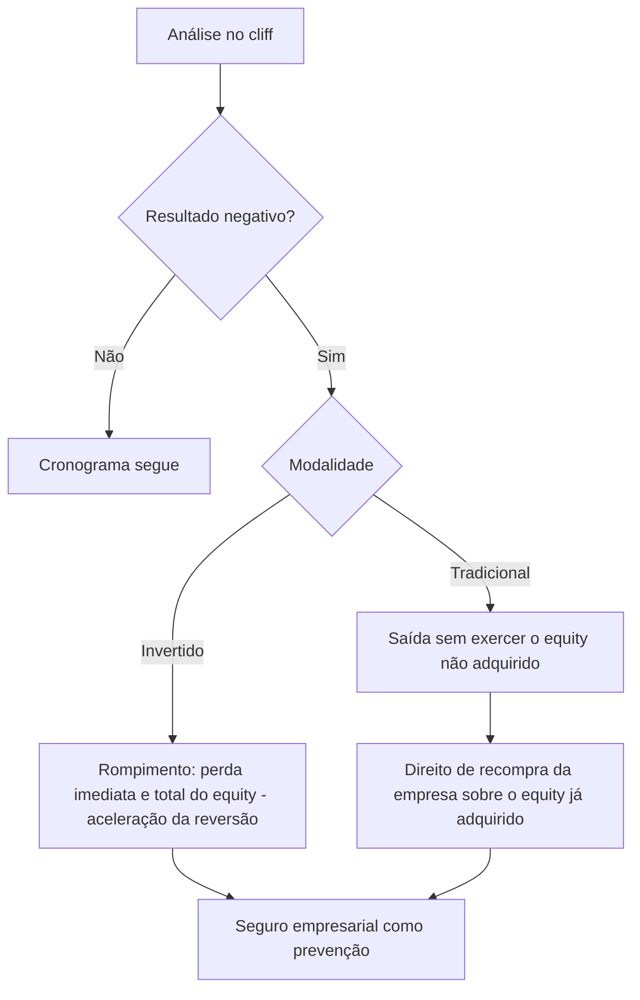

# Vesting Termination and Acceleration

O contrato de vesting deve prever a hipótese de a empresa se frustrar com a pessoa vinculada. Quando um cliff traz um resultado negativo, esse resultado pode culminar no rompimento da relação — e o contrato precisa antecipar as consequências desse rompimento para cada modalidade.

No [[Inverted Vesting]], o rompimento acelera a reversão do equity: como o beneficiário já exerce o direito desde o início (condição resolutiva), o rompimento provoca a perda imediata e total do equity ainda sujeito a essa condição, de uma só vez, em vez da perda gradual cliff a cliff.

No [[Traditional Vesting]], o rompimento leva à saída do indivíduo sem que ele exerça o equity ainda não adquirido (condição suspensiva não implementada), somado ao direito de recompra que a empresa mantém sobre o equity já adquirido.

Em ambos os casos, o seguro empresarial funciona como mecanismo de prevenção da empresa contra os efeitos financeiros desse rompimento.

> [!NOTE] Ressalva terminológica
> No uso de mercado, "aceleração" (acceleration) costuma designar a antecipação do vesting em favor do beneficiário (ex.: cláusulas de aceleração em caso de change of control). Neste estudo, porém, o termo é usado no sentido oposto — aceleração da reversão/perda do equity no rompimento, conforme a modalidade invertida. A confirmar a nomenclatura correta no livro-fonte (ver [[Next Steps]]).

## Related

- [[Cliffs in Vesting Schedules]] — o cliff negativo é o gatilho que pode levar ao rompimento.
- [[Traditional Vesting]] — consequências do rompimento na modalidade suspensiva.
- [[Inverted Vesting]] — consequências do rompimento na modalidade resolutiva.
