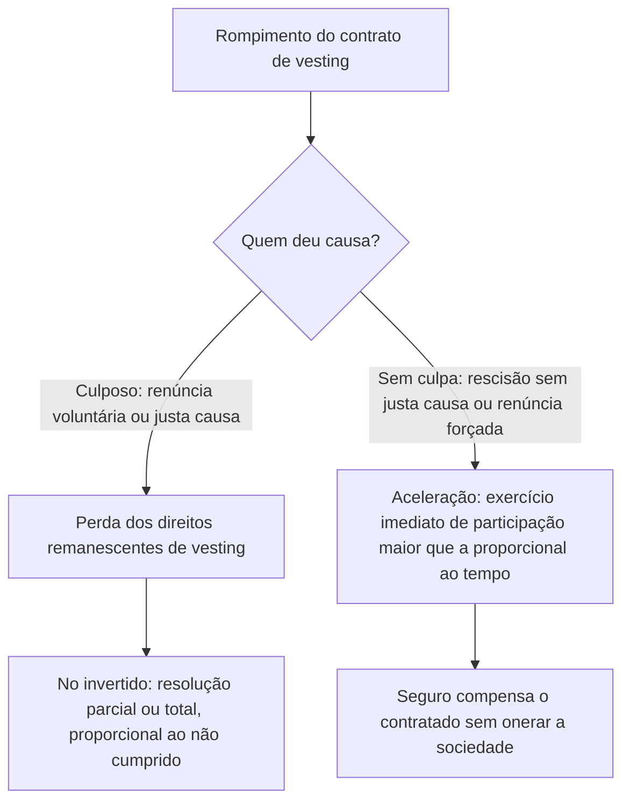

# Vesting Termination and Acceleration

O contrato de vesting deve disciplinar o rompimento da relação com o beneficiário. A consequência jurídica desse rompimento não é uma só — ela depende de **quem deu causa** ao rompimento.

> [!INFO] O que é rompimento "culposo"
> Rompimento **culposo** é aquele causado pela própria conduta do beneficiário: pedido de demissão (renúncia **voluntária**) ou rescisão por **justa causa** (falta grave). Rompimento **sem culpa**, por outro lado, é o que é **imposto** ao beneficiário: rescisão **sem justa causa** promovida pela empresa, ou renúncia **forçada** (quando o beneficiário é levado ou pressionado a se demitir).

Seguindo a proposta de Edwin L. Miller Jr., relatada no livro:

- **Rompimento culposo** → o beneficiário perde os direitos remanescentes de vesting. No [[Inverted Vesting]], essa perda ocorre por **resolução** — parcial, na proporção do que não foi cumprido, ou total, apenas se nada tiver sido atingido.
- **Rompimento sem culpa** → os direitos de vesting devem ser **acelerados**: passam a admitir exercício imediato, e o beneficiário chega a deter uma participação societária **maior** do que teria direito pelo tempo efetivamente decorrido do contrato. Aceleração, portanto, é um mecanismo **a favor do beneficiário**, não uma forma de perda.

> Se, no entanto, a renúncia deu-se por ter sido forçado ou levado a renunciar, ou o contrato foi rescindido sem justa causa, a situação é diferente. Nesses últimos casos, os direitos relacionados ao vesting deverão ser "acelerados", com a possibilidade de exercício imediato. Assim, passaria a deter participação societária maior do que normalmente teria direito a deter pelo tempo decorrido do contrato.
> — Faleiros Júnior, sintetizando Edwin L. Miller Jr. (Vesting Empresarial, 2. ed.)

Note-se que "aceleração", no livro, nunca designa a perda de direitos — a perda por descumprimento de metas é tecnicamente uma **resolução** (ligada à condição resolutiva do vesting invertido; ver [[Inverted Vesting]]).

Como sugestão prática, Marcelo Godke Veiga e Karen Penido, reportando-se a Miller Jr., indicam a contratação de seguros para lidar com essas situações de rompimento/aceleração:

> O ideal, segundo Miller Jr., seria que fossem contratados seguros para lidar com tais situações, o que, ao mesmo tempo, não onera a sociedade e permite algum tipo de compensação financeira ao contratado.
> — Faleiros Júnior, citando Godke Veiga & Penido / Miller Jr.

## Related

- [[Cliffs in Vesting Schedules]] — o resultado apurado em cada cliff é o que determina se houve cumprimento, alimentando a análise de rompimento culposo ou sem culpa.
- [[Traditional Vesting]] — nesta modalidade, a mesma lógica de causa se aplica: o rompimento culposo simplesmente encerra a aquisição futura do equity ainda não investido.
- [[Inverted Vesting]] — modalidade em que a perda por descumprimento se dá tecnicamente por resolução (parcial ou total), e não por "aceleração".
